# 제주를 찾는 재주 / Way to Jeju
>제주도 여행자들이 편리하게 여행을 할 수 있도록 도와주는 웹사이트입니다.  
>audiriley, lynring24, 최수연

### 1. Main
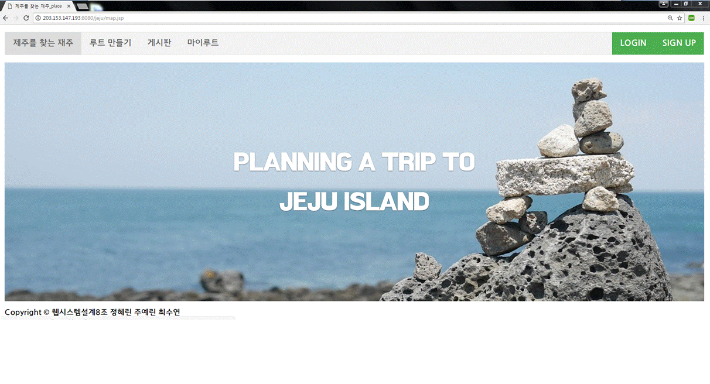

### 2. 여행계획

#### 2-1 경로 : 날짜
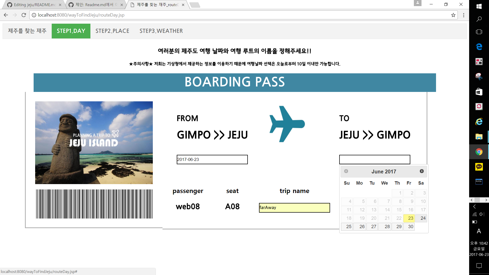

#### 2-2 경로 :장소
문화관광부가 제공하는 제주도 내의 관광지 데이터들을 사용하여 DB의 TOUR테이블에 저장 후, 
그 곳에서 읍/면 단위로 제주도의 관광지 리스트를 보여주어 사용자에게 선택할 수 있게끔 하였다. 
사용자가 선택한 관광지는 지도에 경로를 표시해주고 , 지도로는 goole API를 사용하였다. 
관광지 명으로부터 위도와 경도를 계산해서 전 단계에서 사용자가 입력한 값들과 함께 DB route에 넣어준다. 
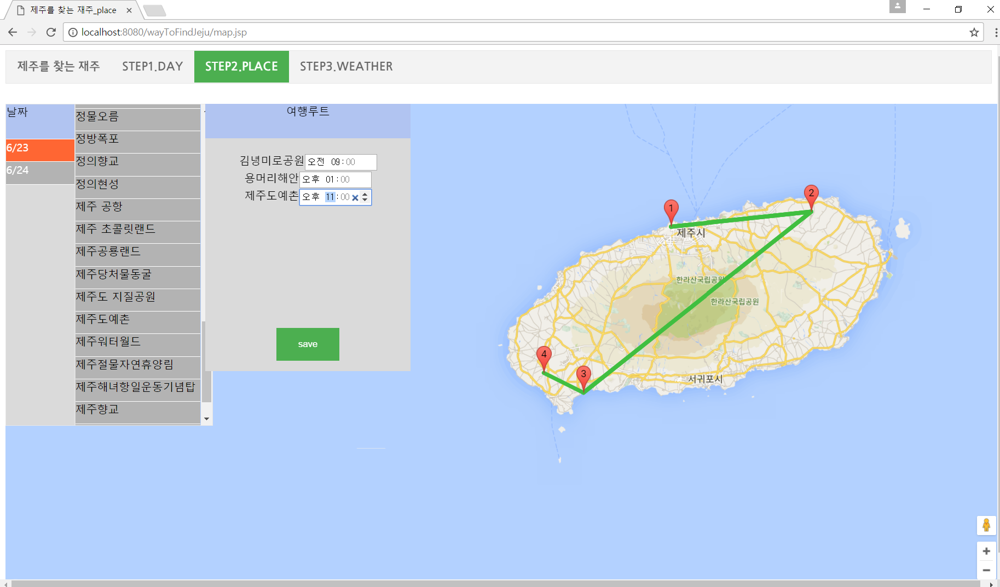

#### 2-3 경로 :날씨
  RSS 방식의 기상청 동네예보, 중기예보 API를 활용하였는데 그 활용 방법은 다음과 같다. 
  &nbsp;&nbsp;1) 장소 선택 단계에서 받았던 위도, 경도 데이터를 기상청 API에 맞게 함수를 통해 변환한다. 
  &nbsp;&nbsp;2) 1번 과정을 한 번 거친 후 변환한 정보를 통해 기상청의 단기, 중기 정보를 가져온다.
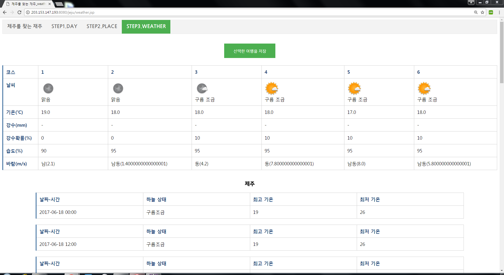
#### 2-4
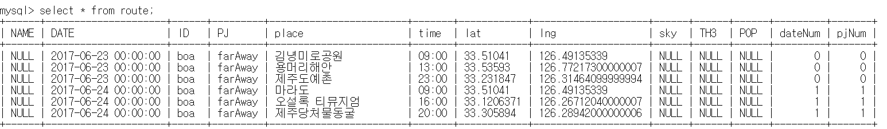

### 3. 마이루트
제주를 찾는 재주를 통해 저장했던 모든 루트들을 확인하고 삭제할 수 있다. 
하루에 해당하는 루트를 한 줄로 하여 날짜, 장소, 방문 예정 시간, 그 시간과 장소에 대한 하늘상태, 기온, 강수확률을 보여준다.  
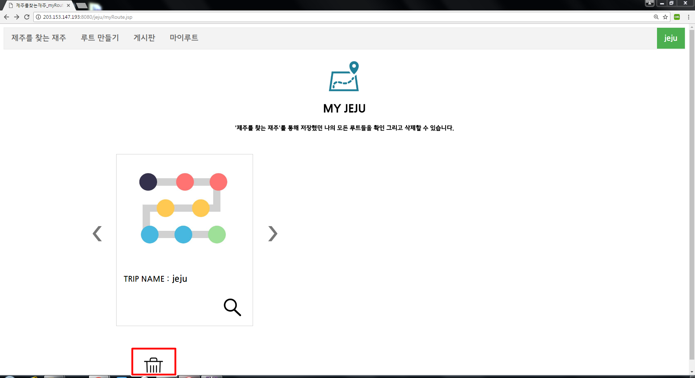
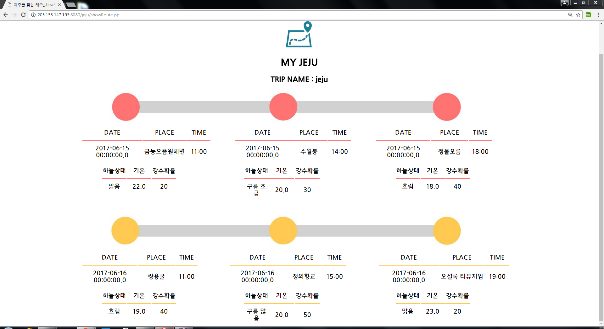

### 4. 게시판
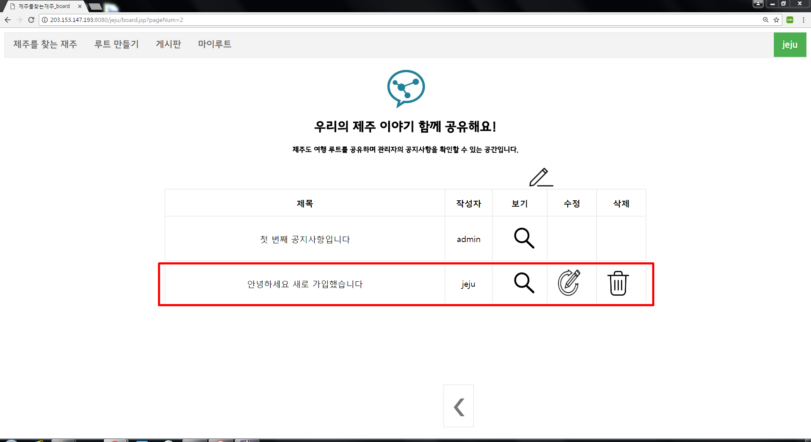 
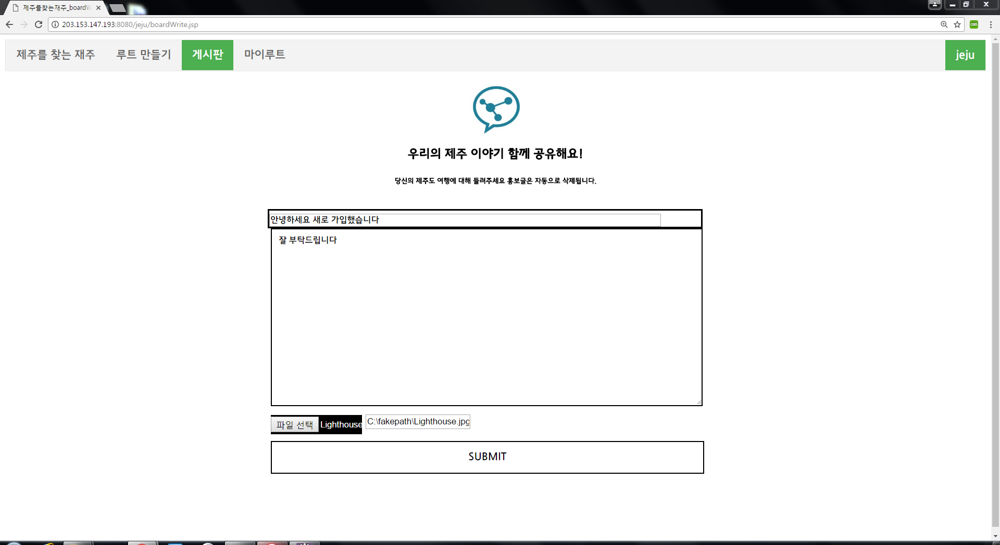
#### 4-1
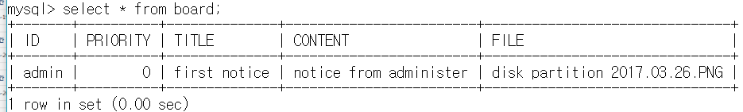

### 5. 회원가입 / 로그인 / 로그아웃
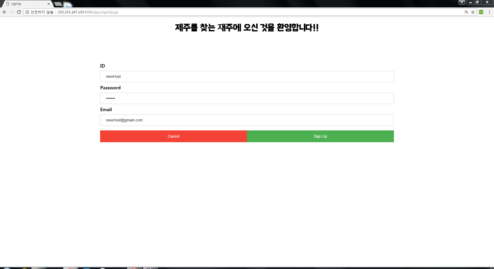 
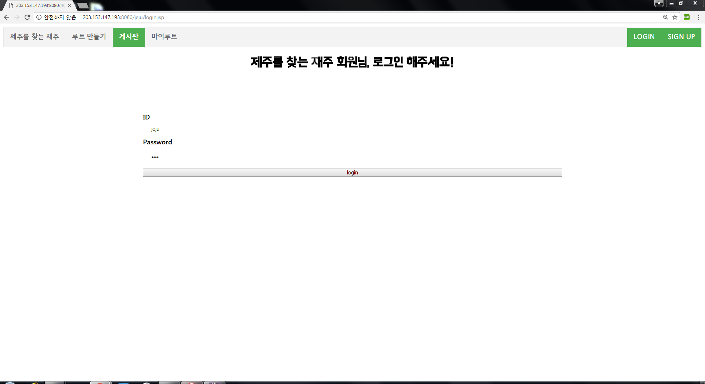 
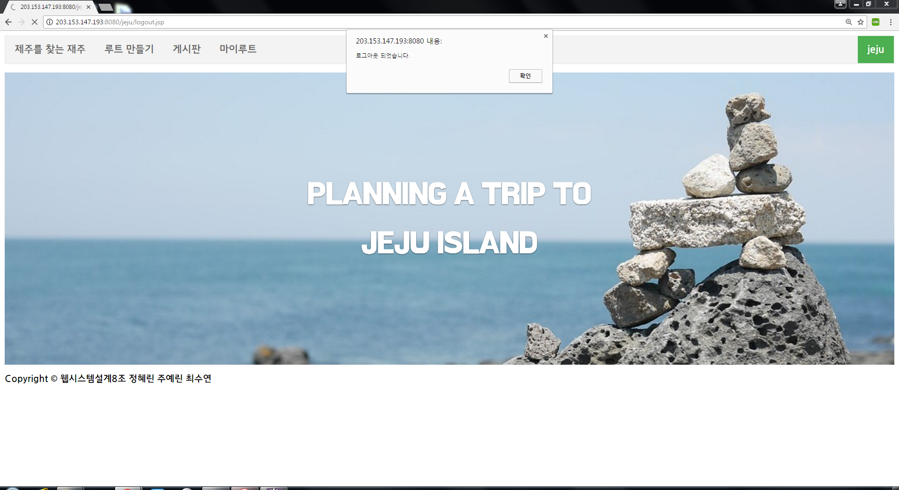 

#### 5-1

---

### 6. 담당
* audiriley 
  - 루트-날씨
  - 기상청api:동네예보/중기예보
  - 코드 병합 버그 처리
* lynring24 
  - 로그인/로그아웃
  - 게시판:글쓰기/보기/목록(버그처리,마무리)
  - 루트:지도
  - 구글 Map api
  - 코드 병합 버그 처리
* 최수연
  - 회원가입
  - 메인
  - 루트:날짜
  - 게시판:목록(초안)/업데이트/삭제
  - 마이루트:전체/경로 보기 
  - CSS 관리
